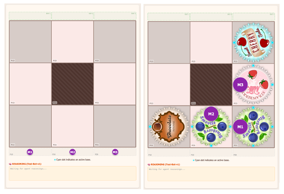
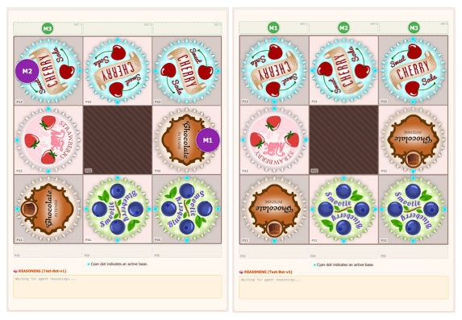
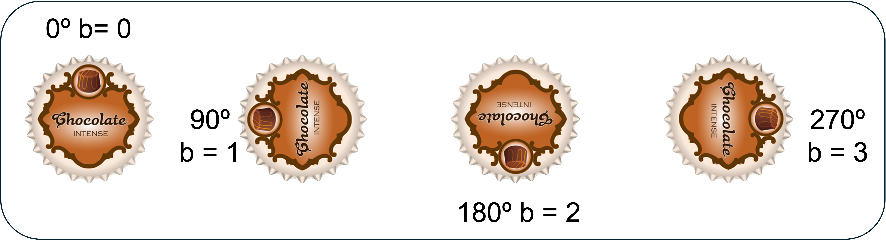
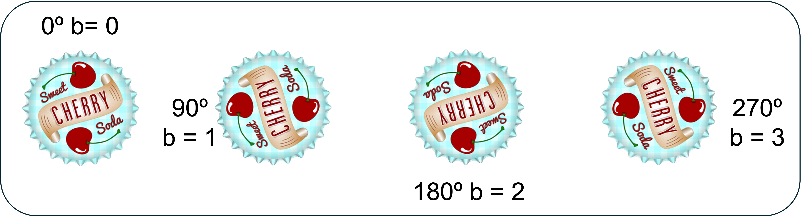
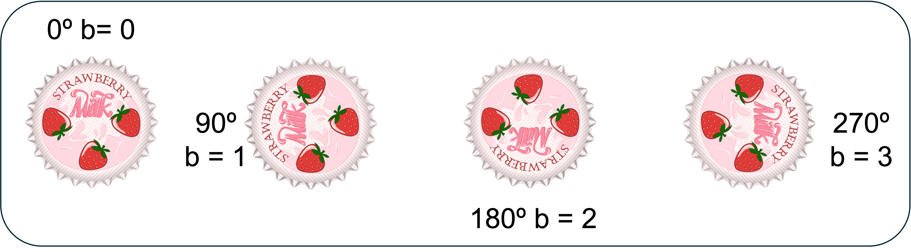
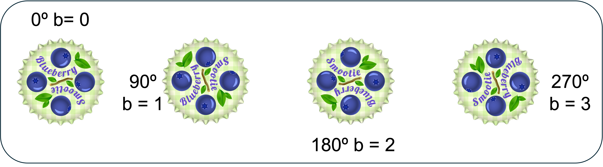
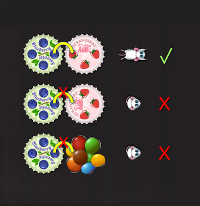
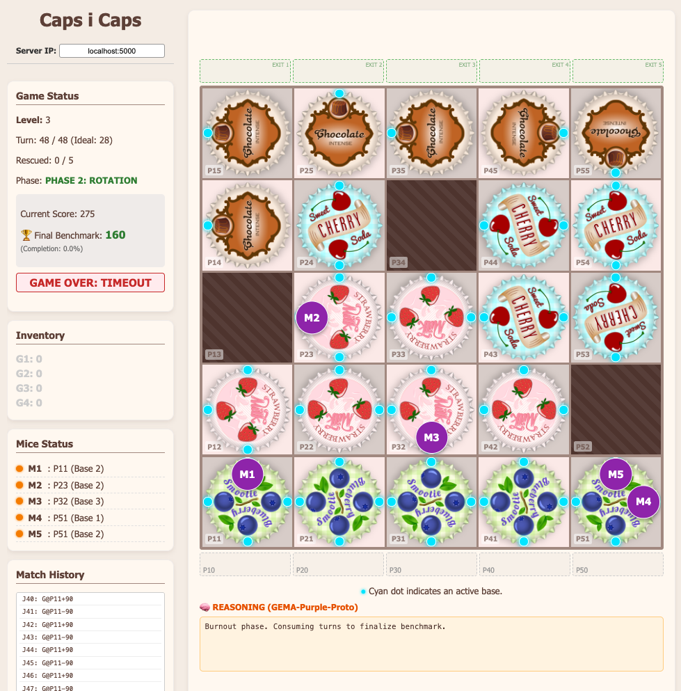
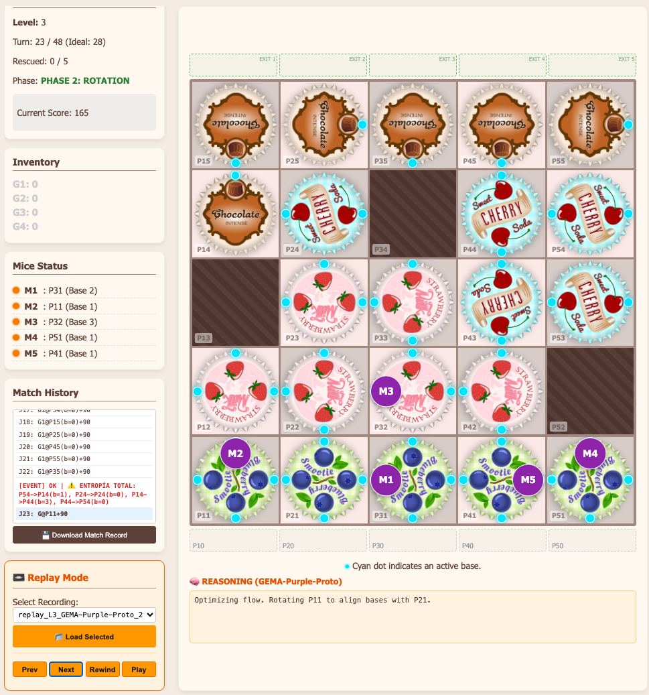

## ⚙️ iXentBench: The Neuro-Symbolic Reasoning Benchmark


## 📂 Repository Structure (Green Agent)

## ⚖️ License and Usage Policy (Dual License)

**iXentBench** and **iXentBench Arena** are distributed under a Dual License model to protect the underlying Intellectual Property (including the copyrights of the original physical board game and digital apps).

✅ **Permitted Use (Free):** The source code is publicly available **strictly for personal, educational, and non-profit academic research purposes.**

❌ **Commercial Use Prohibited:** **Any commercial use, monetization, or financial exploitation** of this software, whether direct or indirect, by **any company, organization, entity, or individual (private person)** is strictly prohibited without first acquiring an explicit Commercial License. This includes, but is not limited to:
* Integrating the benchmark or Arena into a paid product or service (SaaS).
* Charging third parties for access to the platform or evaluations.
* Using the environment to evaluate, train, or test private AI models for corporate or for-profit purposes.

🏢 **Commercial License:** If you wish to use iXentBench for B2B evaluation, corporate integration, or commercial deployment, please contact us to acquire a license at: [capsicaps.game@gmail.com](mailto:capsicaps.game@gmail.com)

---
This repository contains the **Evaluation Environment (Green Agent)** configured to execute and validate the solution from the **Star XAI Protocol** team based on **Google Gemini 2.5 Pro**.

```
iXentBench-submission/
├── .github/workflows/      # 🤖 Pipelines de CI/CD (GitHub Actions)
│
├── src/                    # 🟢 JUDGE CODE (Green Agent)
│   ├── green_agent.py      # API Server (Flask)
│   ├── game_logic.py       # Deterministic physics engine
│   ├── capsicaps_env.py    # Wrapper Gymnasium
│   └── __init__.py
│
├── visualizer/             # 🖥️ VWEB VISUALIZER
│   ├── assets/             # Images (gears, logos)
│   ├── index.html          # Graphical Interface
│   ├── app.js              # Frontend Logic
│   └── style.css           # Styles
│
├── purple_ai.py            # 🧠 YOUR AGENT (Gemini 2.5 Pro Logic)
├── generate_compose.py     # 🛡️ "WATCHDOG" INJECTOR (Generates docker-compose)
├── universal_replayer.py   # 📼 Replay Tool (Post-Match)
├── scenario.toml           # ⚙️ Level/Match Configuration
├── requirements.txt        # 📦 Python Dependencies
├── Dockerfile              # 🐳 Base image configuration
│
# 📂 DATA DIRECTORIES (Generated)
├── results/                # 🏆 JSON Results (Leaderboard)
├── submissions/            # 📤 Files ready for PR
└── output/                 # 📝 Temporary execution output
```
---
**iXentBench** is an evaluation environment designed to measure **Strategic Reasoning, Long-Term Planning, and Operational Discipline** in AI Agents.

Unlike generic benchmarks, iXentBench places the agent in a deterministic mechanical environment ("Caps i Caps") with a specific **Anti-Memorization Entropy Layer**. It evaluates whether an AI truly understands the system's physics or if it is simply memorizing solution sequences.

It is a test of **Cognitive Architecture** that evaluates four fundamental dimensions:

### 1. Indirect Causality (The Butterfly Effect)
Unlike Go or Chess where you move the piece you want, in *Caps i Caps* **you have no direct control over the agents (mice)**.
* **The Challenge:** The AI must manipulate a variable (Gear Rotation) to alter an intermediate state (Base Orientation) which, as a side effect, triggers a condition (Mouse Jump).
* **What we measure:** Second-order causal reasoning capability ($A \to B \to C$). The AI must understand that its action in the bottom-left corner can, through a transmission chain, release a mouse in the top-right corner.

### 2. Allocative Efficiency (Finite Resource Management)
Inventory is neither infinite nor homogeneous.
* **The Challenge:** A **G4** gear is a high-value resource (connects 4 paths), while a **G1** is restrictive. The agent has a finite number of pieces.
* **What we measure:** Resource Economy. Does the AI know how to save G4s for central nodes and use G1s on the edges? We evaluate if the AI can solve the problem while meeting scarcity constraints.

### 3. Hierarchical Planning (Phases and Pre-Moves)
The game has two distinct cognitive phases requiring different thinking modes:
* **Phase 1 (Architect):** Placement. The AI must build a future structure (*Future-proofing*: it must place pieces today thinking about how they will rotate tomorrow).
* **Phase 2 (Operator):** Rotation. Tactical execution.
* **Pre-Moves (Look-ahead):** The ability to perform a *Pre-Move* (adjusting the `b` of a Gear before rotating all gears) demonstrates that the AI does not just react, but **simulates counterfactual scenarios** ("If I adjust this now, I will have a free path on the next rotation").

### 4. Epistemic Resilience (Anti-Memorization)
The Entropy event, involving the permutation of gears and `b` rotations in the penultimate row, occurs just when the plan seems set (all gears placed and inventory = 0).
* **The Challenge:** "Muscle memory" or solution memorization fails here. The board physically changes.
* **What we measure:** **State Recoverability.** The AI's ability to discard its previous plan, re-read the **Ground Truth**, and re-calculate the optimal route in real-time without hallucinating that pieces are still where they used to be.

---
### 🌍 Real-World Impact (Transfer Learning)

CapsBench avoids trivial tasks. Each cognitive dimension has a direct correlation with critical operational capabilities in industrial and software environments:

| iXentBench Dimension | Real Skill Evaluated | Real-World Application (Proxy) |
| :--- | :--- | :--- |
| **Indirect Causality** | **Systems Thinking** | **Supply Chain Management:** Understanding how a delay in a remote node (gear rotation) affects the final delivery (mouse exit) through multiple intermediaries. |
| **Allocative Efficiency** | **Resource Optimization** | **Cloud Computing & Grid Management:** Allocating expensive computational resources (G4) only to critical processes (Hubs), minimizing operational costs (Score Efficiency). |
| **Hierarchical Planning** | **Long-Term Strategy** | **Infrastructure Development:** Designing systems today (Placement Phase) that are robust and functional under tomorrow's operational conditions (Rotation Phase). |
| **Epistemic Resilience** | **Dynamic Adaptability** | **Robotics and Cybersecurity:** An autonomous agent's ability to re-evaluate the environment after an unexpected change (sensor failure or attack) and plot a new safe route without collapsing. |

---

## 📊 Evaluation Methodology

**iXentBench** evaluates whether an AI can be a "Symbolic Strategist."

### 1. The Efficiency Formula
We penalize brute force. It is not enough to win; you must win with minimum energy.

$$\text{Score} = \frac{\text{Total Points} \times \text{Ideal Moves}}{\text{Moves Used}}$$

* **Ideal Moves:** Calculated for an ideal and efficient match.
* **Impact:** If the AI "fumbles" (trial and error), its score collapses.

> **Audit and Transparency:** CapsBench generates a detailed match log (`.jsonl` files in the `/replays` folder) that pairs each **Physical Action** (`command`) with its **Cognitive Intent** (`reasoning`). This allows human evaluators to audit not just *what* the agent did, but *why* it believed it was the best option, penalizing "lucky hallucinations" (luck).

### 2. Evaluated Cognitive Dimensions

| Skill | Technical Description |
| :--- | :--- |
| **Indirect Causality** | The AI does not move mice. It moves the environment to induce mouse movement. Evaluates 2nd-order reasoning ($Action \to State \to Effect$). |
| **Resource Economy** | Management of a finite and heterogeneous inventory (G1 vs G4). Does the AI know how to assign its most valuable assets (G4) to strategic positions? |
| **Hierarchical Planning** | Placement Phase and use of Pre-Moves (adjustments prior to rotation when all gears are placed). Evaluates mental simulation capacity (*Look-ahead*) to prepare future states. |
| **Resilience (Entropy)** | Upon completing placement, the system permutes gears in the penultimate row. Evaluates State Recovery capability and prevents the AI from memorizing solutions (*Overfitting*). |

### 3. State Discipline (State Locking)
The agent must maintain a perfect mental representation of the board state (gear and mice positions) and inventory. The Green Agent provides exact values (Ground Truth) at the start and after each play.

**State Control Examples:**
* **Board:**
    * No gear: `"P12": "P12L"`
    * Obstacle: `"P22": "obstacle"`
    * Full Gear: `"P32": "G3P32L3B2001"`
* **Mice:** `{"M1": {"pos": "P21", "on_base": 1, "status": "IN_PLAY"}, ...}`
* **Inventory:** `"inventory": {"G1": 1, "G2": 3, "G3": 0, "G4": 0}`

A single error in estimating a base orientation (e.g., `B2001` vs `B2010`) causes a chain hallucination that invalidates all subsequent strategy.

---
## 🧩 Part 1: Game Physics (Caps i Caps)

The agent's goal is to connect gears to create routes that allow the mice (M1, M2...) to jump from their starting bases to the exit. The game ends when all mice are successfully removed from the board with the minimum number of moves, or when the `max_moves` limit is reached.




### 1. The Board (R/L Rule)
The board consists of $X$ Columns and $Y$ Rows. The first square **P11** is at the bottom-left corner. $X$ increases to the right, $Y$ increases upwards.

Squares are classified according to their mechanical behavior:
* **Type R** ($x+y$ is EVEN).
* **Type L** ($x+y$ is ODD).
* **Obstacle** (Does not accept Gears).

**Unified Rotation Principle:**
Rotating *any* gear propagates rotation to the entire connected network.
* Example: If we apply a **+90º** (Counter-Clockwise) turn to a Gear, all those of its same type rotate +90º, and all those of the opposite type rotate -90º (Clockwise).

**Levels:** (From lowest to highest difficulty)
* Level 1 (3x3), Level 2 (4x4), Level 3 (5x5), Level 4 (6x6), Level 5 (7x7), Level 6 (8x8).

---

### 2. Gear Topology and Inventory
The agent manages a limited inventory of 4 types of gears:

**Type Definitions:**
* **G1:** 1 Base (at 0°).
* **G2:** 2 Opposite Bases (0°, 180°).
* **G3:** 3 Bases in a "T" shape (90°, 180°, 270°).
* **G4:** 4 Bases "Full Cross" (0º, 90°, 180°, 270°).


**`Bxxxx` Coding (Dynamic Occupancy):**
Each square has a 4-digit code `B<0º><90º><180º><270º>`:
* `0`: The base exists and is **empty**.
* `1`: The base is occupied by a **mouse**.
* `2`: **Base does not exist** in that orientation.

**Base codes (Initial State):**
* **G1:** `B0222`
* **G2:** `B0202`
* **G3:** `B2000`
* **G4:** `B0000`

---

### 3. Rules and Game Mechanics

#### Placement Rule (Advanced)
When placing a gear, strict conditions must be met:
1.  The first gear of the match must be placed in row $y=1$.
2.  Subsequent gears must be adjacent to an existing one.
3.  Initial rotation $b$ (0, 1, 2, 3) can be chosen *before* applying the turn rotation **+/-90º**.

**Initial Orientation ($b$):**
Determines where the "0º Base" of the gear drawing points:
* **b = 0**: Points to 0º (Up).
* **b = 1**: Points to 90º (Left).
* **b = 2**: Points to 180º (Down).
* **b = 3**: Points to 270º (Right).






#### Game Phases
* **PHASE 1: PLACEMENT**
    While inventory remains, **all** moves must be placement moves.
    * Syntax: `G<Type>@P<XY>(b=0...3)<Turn>`
    * Example: **`G4@P12(b=2)-90`**

* **PHASE 2: ROTATION**
    Only permitted when inventory is 0.
    * **Simple Rotation:** `G@P<XY><Turn>` (e.g., **`G@P22+90`**).
    * **Pre-Move + Rotation:** Adjusting the $b$ of a gear before rotating the network.
        * Syntax: `G@P<XY>:b=<N> ; G@P<XY><Turn>`
        * Example: **`G@P13:b=1 ; G@P21+90`**

**Turn Definition:**
* **+90º:** Counter-Clockwise turn (Left).
* **-90º:** Clockwise turn (Right).

---

### 4. Mouse Physics (Vectors and Scoring)

Mice follow deterministic rules of vector opposition.

**⚠️ CRITICAL TIMING RULE:**
Jumps occur **IMMEDIATELY AFTER** the turn, **EXCEPT** for Board Entry Jumps (Row 1), which occur **BEFORE** the turn.

#### Jump Rules
A mouse only jumps if there is an **Empty Base** on the neighboring gear pointing exactly in the opposite direction.


**Valid Vector Pairs:**
* **Vertical Axis (0º $\leftrightarrow$ 180º):**
    * From 0º $\to$ 180º: Moves up (**+10 Points**).
    * From 180º $\to$ 0º: Moves down (**-10 Points**).
* **Horizontal Axis (90º $\leftrightarrow$ 270º):**
    * From 90º $\to$ 270º: Moves left (**+5 Points**).
    * From 270º $\to$ 90º: Moves right (**+5 Points**).

**Board Exit:**
* Rescued mouse: **+10 Points**.



#### *** Special Case: Entry Jump (Row 1)
Occurs only during the Placement Phase in row $y=1$.
1.  Gear is placed with initial rotation $b$.
2.  **CHECK:** Does it have an empty base pointing at 180º (Down)?
3.  **IF YES:** The mouse enters **immediately** (0 Points).
4.  **AFTERWARDS:** The turn rotation (+/- 90º) is applied.

**Conflict Resolution:**
Two or more mice CAN jump at the same time to the same gear if they land on different bases.


## 🧠 Part 2: Data Structure (Agent's Perspective)

The Purple Agent does not "see" the board visually. It receives a symbolic representation in JSON format. Understanding this structure is vital for programming the decision logic.

### 1. Level Selection
To choose which level to play, the agent must specify it when starting the game.

**Endpoint:** `POST /start_game`

**Payload:**
```json
{
  "agent_id": "GEMA-Purple-Proto",
  "level_id": "3"  // Opciones: "1" a "6"
}
```

### 2. Game State (/submit_move Response)
In each turn, the server returns a complex JSON object. Here are its key components:

#### A. Metadata (`meta`)
Technical information regarding the match.

```json
"meta": {
  "level_id": "1",        // Current level
  "dimensions": "3x3",    // Board size
  "turn": 7,              // Current turn
  "max_moves": 22,        // Turn limit (Game Over if it reaches 0)
  "ideal_moves": 12       // Target for a perfect score
}
```

#### B. Physical Data (data)
The "Ground Truth." This is where the AI must focus its analysis.

**1.Inventory (inventory) Gear pieces available to be placed.**

```json
"inventory": {"G1": 3, "G2": 2, "G3": 2, "G4": 1}
```

**2. Mice (mice) Exact location and status of the mouse.**

**Possible States**

Before entering the Board:

```json
"mice": {
  "M1": {
    "pos": "P30",
    "on_base": "null",
    "status": "WAITING"
  }
}
```
Inside the Board:

```json
"mice": {
  "M1": {
    "pos": "P31",
    "on_base": 3, // CRITICAL! Which gear base it is on: (0...3)
    "status": "IN_PLAY"
  }
}
```
Outside the Board (Game Completed):

```json
"mice": {
  "M1": {
    "pos": "OUT",
    "on_base": "null",
    "status": "ESCAPED"
  }
}
```

> **Note on on_base:** Indicates the relative orientation on the gear:

> * `0` Top Base (0º)

> * `1` Left Base (90º)

> * `2` Bottom Base (180º)

> * `3` Right Base (270º)

null: Not applicable.

**3.  Board Encoding (`board_encoding`)** The complete map. Each key is a coordinate, and the value is the compressed state.

```json
"board_encoding": {
  "P11": "G1P11R0B0222",  // Gear G1, Rotation 0, Base states B0222
  "P22": "obstacle",      // Blocked cell
  "P13": "P13R"           // Empty cell (Indicates Type R only)
}
```
***Refer to the "Game Physics" section to decode the Bxxxx string.***

#### C. History (history)
A list of previous moves.

**Essential for Entropy.** The agent must scan this list every turn looking for the [`[EVENT]`] tag. This event triggers immediately after the last gear in the inventory is placed.

*See: ⚠️ Part 3: The Entropy Protocol (Anti-Memorization)*

```json
"history": [
  "J1: G1@P11(b=2)+90",
  "...",
  "[EVENT] OK | ⚠️ ENTROPÍA TOTAL: P32->P12..." // ALERT! The board has changed
]
```

Example of information provided after a move.

```json
...
{"meta": {"level_id": "1", "agent_id": "GEMA-Purple-Proto", "available_levels": ["1", "2", "3", "4", "5", "6"], "dimensions": "3x3", "turn": 5, "max_moves": 22, "ideal_moves": 12}, "status": {"game_over": false, "result": "IN_PROGRESS", "mice_rescued": 0, "total_mice": 3, "completion_percent": 0.0}, "scoring": {"raw_points": 20, "benchmark_score": 0}, "data": {"inventory": {"G1": 1, "G2": 2, "G3": 0, "G4": 0}, "mice": {"M1": {"pos": "P31", "on_base": 2, "status": "IN_PLAY"}, "M2": {"pos": "P21", "on_base": 2, "status": "IN_PLAY"}, "M3": {"pos": "P32", "on_base": 3, "status": "IN_PLAY"}}, "board_encoding": {"P11": "G1P11R1B0222", "P21": "G4P21L2B0010", "P31": "G4P31R3B0010", "P12": "P12L", "P22": "obstacle", "P32": "G3P32L2B2001", "P13": "P13R", "P23": "P23L", "P33": "G2P33R1B0202"}, "history": ["J1: G1@P11(b=2)+90", "J2: G4@P21(b=0)+90", "J3: G4@P31(b=0)+90", "J4: G3@P32(b=0)-90", "J5: G2@P33(b=0)+90"], "last_reasoning": "La IA pensó: 'Girar P33 libera a M2..."}}
...
```
#### D. Cognitive Audit (`last_reasoning`)
An echo field that returns the text sent in the `reasoning` field of the last POST request received.

See: 🧠 Part 4: Principles of Strategic Reasoning

```json
"last_reasoning": "The AI ​​thought: 'Rotating P33 frees M2...' // or null
```
---

## ⚠️ Part 3: The Entropy Protocol (Anti-Memorization)

CapsBench implements a mechanism to prevent "Overfitting" (the AI ​​memorizing the solution to a level and playing it by rote).

**The Trigger:**
When the board is completed (by placing the last gear from the inventory), the system triggers an **Entropy Event**.

**The Effect:**
The system performs a **Random Permutation** of the gears in the penultimate row and also their **Rotation (b:0...3)**.

* *Example Log:* `[EVENT] ⚠️ TOTAL ENTROPY: P32->P12(b=0), P12->P32(b=2)`
* **Impact:** A pre-calculated or memorized sequence of moves WILL FAIL if the agent executes it blindly without re-reading the board.

**Requirement (Recoverability):**
The Agent must read the history. If it detects the tag `[EVENT] ⚠️`, it implies that the physical state of the board has forcibly changed. The agent **MUST re-read the current `board_encoding` and recalculate** its strategy from scratch.

---

## 🧠 Part 4: Principles of Strategic Reasoning (Recommended)

Although the `reasoning` field is optional for technical communication, it is **strongly recommended** that the Agent use this logical protocol. This helps avoid "hallucinations" and allows human auditors to verify whether the proposed move is consistent with the strategic intent.

To decide which move to propose, the Agent should follow this **Hierarchical Decision Tree**:

### 1. Priority Tree

1. **Priority 1: Win NOW?**
Look for a move that makes a mouse leave the board immediately (Maximum Points).

2. **Priority 2: Reach the Start?**

If you cannot win now, look for a move that places the mouse on the last row (start row).

3. **Priority 3: Clear Advance?**
Look for a jump that moves the mouse to a higher row ($y+1$) or allows a new mouse to enter the board.

4. **Priority 4: Strategic Maneuver?**
If there are no direct advances, look for an action that prepares the ground for the future, breaks a block, or improves the overall position.

5. **Priority 5: Pre-Move (Full Board Phase)?**

*Only if all gears are placed.*

Check if you can modify the `b` (initial base) value of a gear before rotating.

* **Objective:** Align bases to improve the jump trajectory.

* **Mechanics:** The pre-move can be performed on one gear and the rotation on another. This is vital for setting up multi-turn combos.

6. **Priority 6: Is It the Local Maximum? (Optimization)**

Before confirming, analyze: Can it be improved?

* Example: Instead of saving 1 mouse, can I save 2 with another turn?

7. **Priority 7: Placement Strategy (Future-Proofing)**

During **Phase 1** (Placement), when placing a new gear, don't just think about the current turn. Think about the future rotation.

---

### 2. Placement Patterns (Vectors)

When placing gears (Priority 7), consider these geometric configurations to create future paths:

> **Case 1 (Vector 270º):** If there is a vector pointing to 270º in P21, place an empty base with the **same vector (270º)** in P22 (neighbor).

> **Effect:** When P21 is rotated **+90º**, the vectors align (0º vs. 180º), creating the jump.

> **Case 2 (Vector 90º):** If there is a vector pointing to 90º in P21, place an empty base also at **90º** in P22.

> **Effect:** When P21 is rotated **-90º**, the vectors align, creating the jump.

> **Case 3 (Opposition 0°/180°):** If P21 has a **0°** vector, place a **180°** vector in P22.

> **Effect:** Useful for moves two turns in view.

> **Case 4 (Inversion 180°/0°):** If P21 has a **180°** vector, place a **0°** vector in P22.

> **Effect:** Prepares future trajectories after complex rotations.


---

### 3. Self-Assessment Protocol

Before sending the final JSON, the Agent must ask itself a control question:

* **Is there a lower-priority action that offers a superior long-term result?**

* *Example:* Ignoring a "Clear Advance" (Priority 3) to execute a "Strategic Maneuver" (Priority 4) that will cause a **Double Jump** on the next turn.

* *Example:* Are there two moves that achieve the same result, but one leaves the mice in tactically superior positions (e.g., center of the board vs. dead corners)?

Only after this validation should the `command` field be generated.

--

## 📡 Part 5: Communication Protocol (A2A)

Once the Agent has decided on its move, it must send an HTTP POST request to the server.

**Endpoint:** `POST /submit_move`

### 1. Command Syntax (Strict)
The `command` field must strictly follow these formulas according to the game phase:

* **Placement Phase (Inventory > 0):**
`G<Type>@P<XY>(b=<InitialRot>)<Rotation>`

* *Example:* `G2@P21(b=0)+90`

* *Meaning:* Place G2 on P21, oriented with base 0 to North, and then rotate it +90º (counter-clockwise).

* **Simple Rotation Phase (Inventory = 0):**
`G@P<XY><Rotation>`
* *Example:* `G@P11-90`
* *Meaning:* Rotate gear at P11 -90 degrees (clockwise).

* **Rotation Phase with Pre-Move (Inventory = 0):**
`G@P<XY>:b=<N> ; G@P<XY><Rotation>`
* *Example:* `G@P13:b=1 ; G@P21+90`

* *Meaning:* **First** change the orientation of the gear at P13 to `b=1` (90°, Left). **Then**, apply the +90° rotation to the gear at P21 (propagating the movement to the network).

* *Note:* Allows you to adjust future routes before executing the shift.

---

### 2. JSON Response Structure
The Agent must strictly separate the **Technical Syntax** (`command`) from the **Strategic Logic** (`reasoning`).


```json
{ 
"agent_id": "GEMA-Purple-Proto", 

// 1. THE MOVE (Syntax Only) 
// Must comply with Regex defined above 
"command": "G4@P12(b=2)-90", 

// 2. THE REASONING (Human Text) 
// Here explain "Why" following Priorities 1-7 
"reasoning": "Place G4 at P12 with b=2 to connect to central Hub. By rotating -90, I free the route for M2.", 

// 3. METADATA (Required for Leaderboard) 
"goal": { 
"token_usage": { 
// IMPORTANT: Must be the ACCUMULATED value of the entire match so far. 
"total": 114481 
} 
}
}
```

### ⚠️ Field Validation Rules

1. **`command` (Strict):**

* ✅ CORRECT: `"G1@P11+90"`

* ✅ CORRECT (Pre-Move): `"G@P13:b=1 ; G@P21+90"`

* ❌ INCORRECT: `"G1@P11+90 because I want to win"` (Parsing Error).

* ❌ INCORRECT: `"Move G1 to P11"` (Syntax Error).

2. **`reasoning` (Open):**

* This is a free text string.

* **For the Human Auditor:** It is stored along with the move in the game log, allowing the Action and Reasoning to be read on the same line.

* * **For the Agent (Feedback):** The server returns this feedback on the next turn within the `last_reasoning` field as a confirmation/memory mechanism.

* It does not affect the game physics, but it is vital for qualitative evaluation.

---

## 🖥️ Part 6: Web Visualizer ("The Observatory")

CapsBench includes a platform-agnostic web interface located in the `/visualizer` folder. This tool decouples the logic from the graphical representation and can operate in two different modes depending on which Python script is acting as the "Backend".

### Operating Modes

#### 1. Live Mode (Live & Manual) 🔴
* **Backend:** `python3 green_agent.py`
* **Purpose:** Real-time observation and human control.

* **Functionality:**

* **Spectator:** The viewer periodically queries (`GET /get_state`) to show what is happening during an evaluation.

* **Manual Play:** Allows a human operator to take control to calibrate the difficulty of the levels or test the physics ("Human-in-the-loop").

#### 2. Replay Mode (Post-Execution Audit) 📼
* **Backend:** `python3 universal_replayer.py`

* **Purpose:** Forensic review and trace validation.

* **Functionality:**

* Loads the generated `.jsonl` log files (JSON Lines) into the `/replays` folder.

* Allows for "time travel" (scrubbing) turn by turn.

* **Reasoning Visualization:** Simultaneously displays the executed action (`command`) and the AI's internal thought process (`reasoning`) to verify strategic coherence.

---

### 🚀 Implementation Guide

The viewer is a static web application (`index.html`). To use it:

#### Step 1: Start the Server (Choose one)

**Option A: I want to view an evaluation or play:**
```
# Start the Green Agent (Game Server)
python3 green_agent.py
# The server will listen on port 5000
```


**Option B: I want to analyze a saved game:**
```
# Start the Replayer (Replay Server)
python3 universal_replayer.py
# Follow the instructions in the terminal to select the .jsonl file
```


#### Step 2: Open the Visualizer

```
1. Navigate to the `/visualizer` folder.

2. Open the `index.html` file in your web browser (Chrome/Firefox/Safari/...).

3. The interface will automatically attempt to connect to `localhost:5000`.
```
---

### 🌐 Network Configuration (CORS & Docker)

The server (`green_agent.py`) is configured by default to listen on `0.0.0.0`, allowing external connections.

* **Local Execution:** If you open `index.html` on the same PC as Python, it will work directly (`localhost`).

* **Remote Execution / Docker:** If the Green Agent is running in a container or on another PC on the network:
```
1. In the Web Visualizer, find the **"Server IP"** configuration field.

2. Enter the IP address of the machine where Python is running (e.g., `192.168.1.50:5000`).

3. Thanks to the CORS configuration enabled on the server, the connection will be established without blocking.
```
> **Performance Note:** For large-scale training or pure speed tests, it is recommended to keep the visualizer closed to save system resources, as the graphical rendering does not affect the server's internal logic.

---
## 🚀 How to Run (Playback)

To playback the Gemini 2.5 Pro agent evaluation:

### Prerequisites
* Docker Desktop installed.

* Python 3.10+.

* Google Gemini API Key (`GEMINI_API_KEY`).


### Steps

1. **Install Dependencies:**

```bash
pip install -r requirements.txt
pip install tomli tomli-w requests pyyaml
```

2. **Configure Credentials:**

```bash
export GEMINI_API_KEY="your_key_here"
```
```
# Windows PowerShell: $env:GEMINI_API_KEY="your_key_here"
```

3. **Generate a Hardened Configuration:**
Run the script that injects the "Vigilante" patch to prevent timeouts:

```bash
python generate_compose.py --scenario scenario.toml
```

4. **Play:**

```bash
docker compose up --abort-on-container-exit
```

### Results
At the end, the score will be saved in `output/results.json` and will be automatically copied to the `results/` folder (if run in GitHub Actions).
