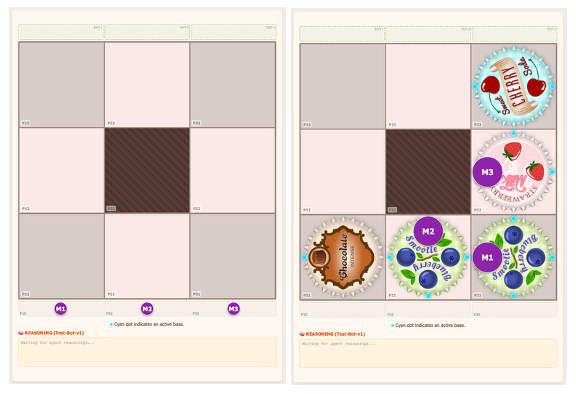
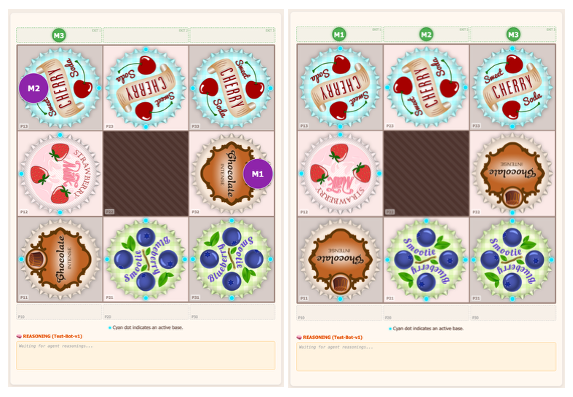
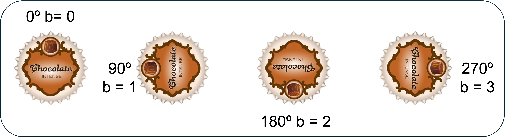
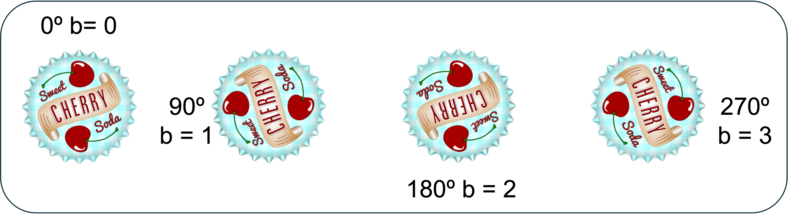
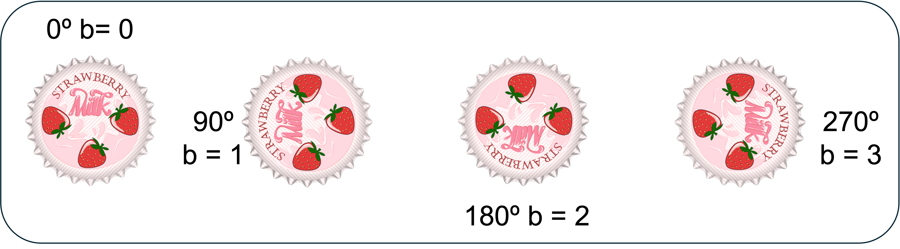
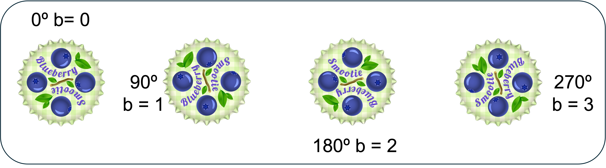
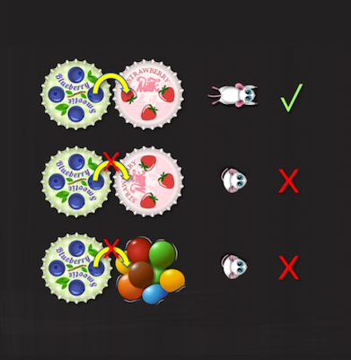
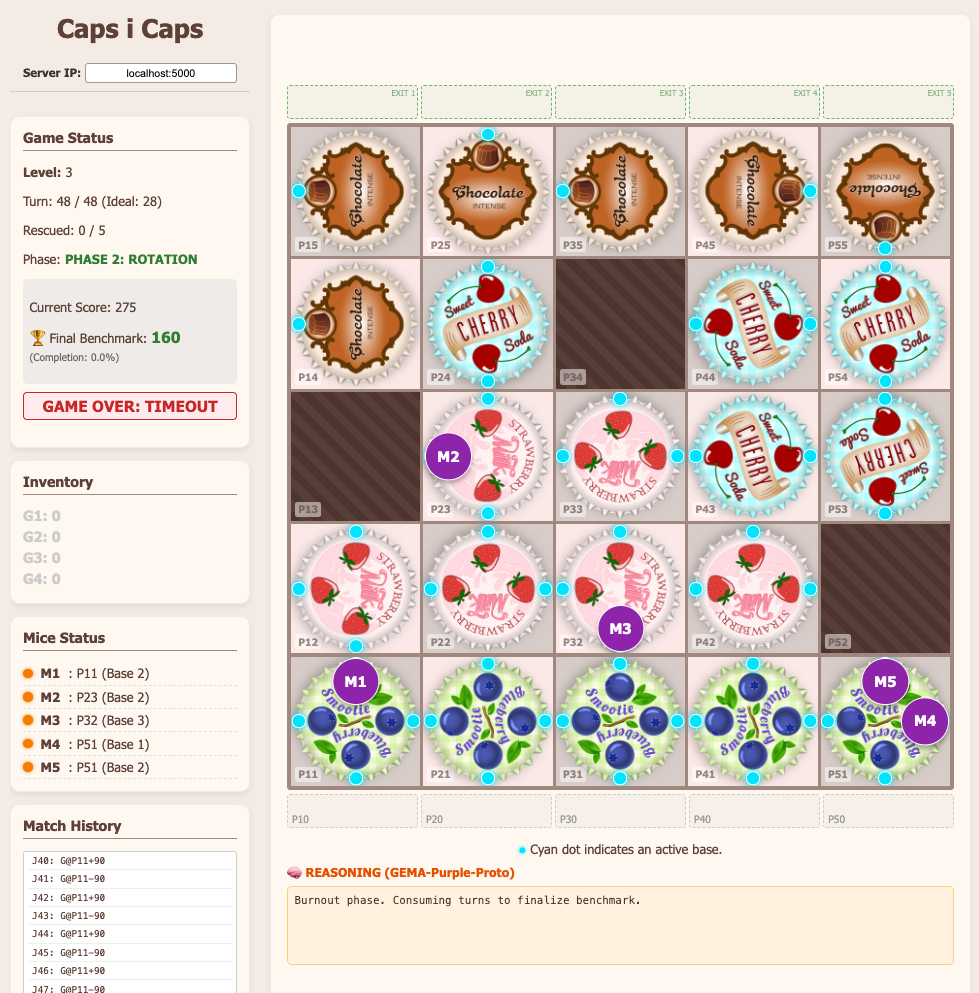
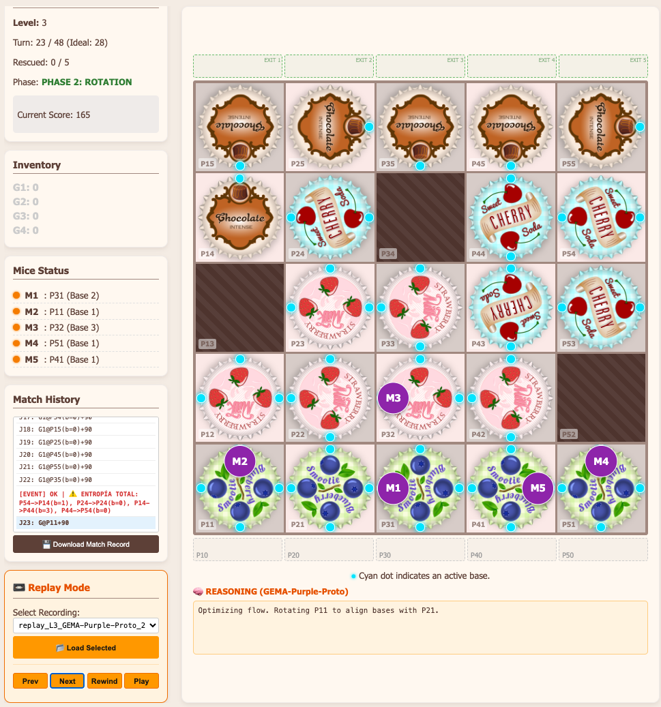

# ⚙️ CapsBench: El Benchmark de Razonamiento Neuro-Simbólico


## 📂 Estructura del Repositorio (Green Agent)

Este repositorio contiene exclusivamente la lógica del **Entorno de Evaluación**, manteniendo una estructura plana para facilitar el despliegue y la lectura del código.

```
capsbench-green/
├── green_agent.py          # 🟢 SERVIDOR A2A (Punto de entrada Docker/Evaluación)
├── capsicaps_env.py        # 🧩 Gymnasium Wrapper (Puente entre API y Lógica)
├── game_logic.py           # ⚙️ Motor de Física Determinista (Reglas del juego)
├── universal_replayer.py   # 📼 Servidor de Auditoría (Replay System)
├── requirements.txt        # 📦 Dependencias (pip install -r requirements.txt)
├── Dockerfile              # 🐳 Configuración de despliegue para AgentBeats
│
├── visualizer/             # 🖥️ VISUALIZADOR WEB (Herramienta Humana)
│   ├── index.html          # Interfaz Gráfica
│   ├── app.js              # Lógica de Conexión
│   └── style.css           # Estilos
│
# 📂 DIRECTORIOS GENERADOS DINÁMICAMENTE (Al ejecutar)
├── logs/                   # 📝 Logs técnicos para depuración
├── replays/                # 📼 Archivos .jsonl (Traza completa)
├── match_records/          # 📄 Resúmenes legibles .txt (Descargables)
└── results/                # 📊 JSONs de salida (Métricas para el Leaderboard)
```

---
**CapsBench** es un entorno de evaluación diseñado para medir capacidades de **Razonamiento Estratégico, Planificación a Largo Plazo y Disciplina Operativa** en Agentes de IA.

A diferencia de los benchmarks genéricos, CapsBench sitúa al agente en un entorno mecánico determinista ("Caps i Caps") con una **Capa de Entropía Anti-Memorización** específica. Evalúa si una IA realmente entiende la física del sistema o si simplemente está memorizando secuencias de soluciones.

Es un test de **Arquitectura Cognitiva** que evalúa cuatro dimensiones fundamentales:

### 1. Causalidad Indirecta (El Efecto Mariposa)
A diferencia de Go o Ajedrez donde mueves la pieza que quieres, en *Caps i Caps* **no tienes control directo sobre los agentes (ratones)**.
* **El Desafío:** La IA debe manipular una variable (Giro del Engranaje) para alterar un estado intermedio (Orientación de las Bases) que, como efecto secundario, dispara una condición (Salto del Ratón).
* **Lo que medimos:** Capacidad de razonamiento causal de segundo orden ($A \to B \to C$). La IA debe entender que su acción en la esquina inferior izquierda puede, mediante una cadena de transmisión, liberar a un ratón en la esquina superior derecha.

### 2. Eficiencia Asignativa (Gestión de Recursos Finitos)
El inventario no es infinito ni homogéneo.
* **El Desafío:** Un engranaje **G4** es un recurso de alto valor (conecta 4 vías), mientras que un **G1** es restrictivo. El agente tiene un número finito de piezas.
* **Lo que medimos:** Economía de Recursos. ¿Sabe la IA guardar los G4 para los nodos centrales y usar los G1 en los bordes? Evaluamos si la IA puede resolver el problema cumpliendo restricciones de escasez.

### 3. Planificación Jerárquica (Fases y Pre-Jugadas)
El juego tiene dos fases cognitivas distintas que requieren modos de pensamiento diferentes:
* **Fase 1 (Arquitecto):** Colocación. La IA debe construir una estructura futura (*Future-proofing*: debe colocar piezas hoy pensando en cómo girarán mañana).
* **Fase 2 (Operador):** Rotación. La ejecución táctica.
* **Pre-Jugadas (Look-ahead):** La capacidad de hacer un *Pre-Move* (ajustar `b` de un Gear antes de girar todos los gears) demuestra que la IA no solo reacciona, sino que **simula escenarios contrafácticos** ("Si ajusto esto ahora, en el siguiente giro tendré una vía libre").

### 4. Resiliencia Epistémica (Anti-Memorización)
El evento de Entropía, con la permutación de gears y giros `b`, de la penúltima fila, ocurre justo cuando el plan parece trazado (Colocación de todos los gears e inventario = 0).
* **El Desafío:** La "memoria muscular" o la memorización de la solución fallan aquí. El tablero cambia físicamente.
* **Lo que medimos:** **Recuperabilidad de Estado.** La capacidad de la IA para desechar su plan anterior, volver a leer la "Verdad del Terreno" (*Ground Truth*) y re-calcular la ruta óptima en tiempo real sin alucinar que las piezas siguen donde estaban.

---
### 🌍 Impacto en el Mundo Real (Transfer Learning)

CapsBench evita tareas triviales. Cada dimensión cognitiva tiene una correlación directa con capacidades operativas críticas en entornos industriales y de software:

| Dimensión CapsBench | Habilidad Real Evaluada | Aplicación en Mundo Real (Proxy) |
| :--- | :--- | :--- |
| **Causalidad Indirecta** | **Pensamiento Sistémico** | **Gestión de Cadenas de Suministro:** Entender cómo un retraso en un nodo remoto (giro de engranaje) afecta a la entrega final (salida del ratón) a través de múltiples intermediarios. |
| **Eficiencia Asignativa** | **Optimización de Recursos** | **Cloud Computing & Grid Management:** Asignar recursos computacionales caros (G4) solo a procesos críticos (Hubs), minimizando costes operativos (Score Efficiency). |
| **Planificación Jerárquica** | **Estrategia a Largo Plazo** | **Desarrollo de Infraestructuras:** Diseñar sistemas hoy (Fase de Colocación) que sean robustos y funcionales bajo las condiciones operativas de mañana (Fase de Rotación). |
| **Resiliencia Epistémica** | **Adaptabilidad Dinámica** | **Robótica y Ciberseguridad:** Capacidad de un agente autónomo para re-evaluar el entorno tras un cambio inesperado (fallo de sensor o ataque) y trazar una nueva ruta segura sin colapsar. |
---

## 📊 Metodología de Evaluación

**CapsBench** evalúa si una IA puede ser un "Estratega Simbólico".

### 1. La Fórmula de la Eficiencia
Penalizamos la fuerza bruta. No basta con ganar; hay que ganar con la mínima energía.

$$\text{Score} = \frac{\text{Puntos Totales} \times \text{Movimientos Ideales}}{\text{Movimientos Usados}}$$

* **Movimientos Ideales:** Calculados para una partida ideal y eficiente.
* **Impacto:** Si la IA "tantea" (prueba y error), su puntuación colapsa.

> **Auditoría y Transparencia:** CapsBench genera un registro detallado de la partida (archivos `.jsonl` en la carpeta `/replays`) que empareja cada **Acción Física** (`command`) con su **Intención Cognitiva** (`reasoning`). Esto permite a los evaluadores humanos auditar no solo *qué* hizo el agente, sino *por qué* creyó que era la mejor opción, penalizando las "alucinaciones acertadas" (suerte).

### 2. Dimensiones Cognitivas Evaluadas

| Habilidad | Descripción Técnica |
| :--- | :--- |
| **Causalidad Indirecta** | La IA no mueve ratones. Mueve el entorno para inducir el movimiento de los ratones. Evalúa razonamiento de 2º orden ($Acción \to Estado \to Efecto$). |
| **Economía de Recursos** | Gestión de un inventario finito y heterogéneo (G1 vs G4). ¿Sabe la IA asignar sus activos más valiosos (G4) a las posiciones estratégicas? |
| **Planificación Jerárquica** | Fase de Colocación y uso de Pre-Moves (ajustes previos al giro cuando ya tenemos todos los gears colocados). Evalúa la capacidad de simulación mental (*Look-ahead*) para preparar estados futuros. |
| **Resiliencia (Entropía)** | Al finalizar la colocación, el sistema permuta gears de la penúltima fila. Evalúa la capacidad de Recuperación de Estado y evita que la IA memorice soluciones (*Overfitting*). |

### 3. Disciplina de Estado (State Locking)
El agente debe mantener una representación mental perfecta del estado del tablero (posición gears y ratones) e inventario. El Green Agent proporciona valores exactos (Ground Truth) al inicio y tras cada jugada.

**Ejemplos de Control de Estado:**
* **Tablero:**
    * Sin gear: `"P12": "P12L"`
    * Obstáculo: `"P22": "obstacle"`
    * Gear completo: `"P32": "G3P32L3B2001"`
* **Ratones:** `{"M1": {"pos": "P21", "on_base": 1, "status": "IN_PLAY"}, ...}`
* **Inventario:** `"inventory": {"G1": 1, "G2": 3, "G3": 0, "G4": 0}`

Un solo error en la estimación de la orientación de una base (ej: `B2001` vs `B2010`) provoca una alucinación en cadena que invalida toda la estrategia posterior.

---
## 🧩 Parte 1: La Física del Juego (Caps i Caps)

El objetivo del agente es conectar engranajes para crear rutas que permitan a los ratones (M1, M2...) saltar desde sus bases iniciales hasta la salida. El juego termina al conseguir sacar a todos los ratones del tablero con el menor número de movimientos, o cuando se agota el límite de `max_moves`.


### 1. El Tablero (Regla R/L)
El tablero consta de $X$ Columnas y $Y$ Filas. La primera casilla **P11** es la de la esquina inferior izquierda. $X$ aumenta hacia la derecha, $Y$ aumenta hacia arriba.

Las casillas se clasifican según su comportamiento mecánico:
* **Tipo R** ($x+y$ es PAR).
* **Tipo L** ($x+y$ es IMPAR).
* **Obstáculo** (No admite Gears).

**Principio de Rotación Unificada:**
Girar *cualquier* engranaje propaga la rotación a toda la red conectada.
* Ejemplo: Si aplicamos un giro **+90º** (Anti-Horario) a un Gear, todos los de su mismo tipo giran +90º, y todos los del tipo opuesto giran -90º (Horario).

**Niveles:** (De menor a Mayor dificultad)
* Level 1 (3x3), Level 2 (4x4), Level 3 (5x5), Level 4 (6x6), Level 5 (7x7), Level 6 (8x8).

---

### 2. Topología de Engranajes e Inventario
El agente gestiona un inventario limitado de 4 tipos de engranajes:

**Definición de Tipos:**
* **G1:** 1 Base (a 0°).
* **G2:** 2 Bases Opuestas (0°, 180°).
* **G3:** 3 Bases en forma de "T" (90°, 180°, 270°).
* **G4:** 4 Bases "Cruz completa" (0º, 90°, 180°, 270°).


**Codificación `Bxxxx` (Ocupación Dinámica):**
Cada casilla tiene un código de 4 dígitos `B<0º><90º><180º><270º>`:
* `0`: La base existe y está **vacía**.
* `1`: La base está ocupada por un **ratón**.
* `2`: **No existe base** en esa orientación.

**Códigos base (Estado Inicial):**
* **G1:** `B0222`
* **G2:** `B0202`
* **G3:** `B2000`
* **G4:** `B0000`

---

### 3. Reglas y Mecánica del Juego

#### Regla de Colocación (Avanzada)
Al colocar un engranaje, se deben cumplir condiciones estrictas:
1.  El primer engranaje de la partida debe ir en la fila $y=1$.
2.  Los siguientes deben ser adyacentes a uno existente.
3.  Se puede elegir su rotación inicial $b$ (0, 1, 2, 3) *antes* de aplicar el giro del turno **+/-90º**.

**Orientación Inicial ($b$):**
Determina hacia dónde apunta la "Base de 0º" del dibujo del engranaje:
* **b = 0**: Apunta a 0º (Arriba).
* **b = 1**: Apunta a 90º (Izquierda).
* **b = 2**: Apunta a 180º (Abajo).
* **b = 3**: Apunta a 270º (Derecha).






#### Fases de Juego
* **FASE 1: COLOCACIÓN**
    Mientras quede inventario, **todos** los movimientos deben ser de colocación.
    * Sintaxis: `G<Tipo>@P<XY>(b=0...3)<Giro>`
    * Ejemplo: **`G4@P12(b=2)-90`**

* **FASE 2: ROTACIÓN**
    Solo permitida cuando el inventario es 0.
    * **Rotación Simple:** `G@P<XY><Giro>` (Ej: **`G@P22+90`**).
    * **Pre-Movimiento + Rotación:** Ajustar la $b$ de un engranaje antes de girar la red.
        * Sintaxis: `G@P<XY>:b=<N> ; G@P<XY><Giro>`
        * Ejemplo: **`G@P13:b=1 ; G@P21+90`**

**Definición de Giro:**
* **+90º:** Giro Anti-Horario (Izquierda).
* **-90º:** Giro Horario (Derecha).

---

### 4. Física de los Ratones (Vectores y Puntuación)

Los ratones siguen reglas deterministas de oposición de vectores.

**⚠️ REGLA CRÍTICA DE TIEMPOS:**
Los saltos ocurren **INMEDIATAMENTE DESPUÉS** del giro, **EXCEPTO** los Saltos de Entrada al Tablero (Fila 1), que ocurren **ANTES** del giro.

#### Reglas de Salto
Un ratón solo salta si hay una **Base Vacía** en el engranaje vecino apuntando exactamente en dirección opuesta.

**Pares de Vectores Válidos:**
* **Eje Vertical (0º $\leftrightarrow$ 180º):**
    * De 0º $\to$ 180º: Sube (**+10 Puntos**).
    * De 180º $\to$ 0º: Baja (**-10 Puntos**).
* **Eje Horizontal (90º $\leftrightarrow$ 270º):**
    * De 90º $\to$ 270º: Izquierda (**+5 Puntos**).
    * De 270º $\to$ 90º: Derecha (**+5 Puntos**).

**Salida del Tablero:**
* Ratón rescatado: **+100 Puntos**.



#### *** Caso Especial: Salto de Entrada (Fila 1)
Ocurre solo durante la Fase de Colocación en la fila $y=1$.
1.  Se coloca el Gear con rotación inicial $b$.
2.  **CHECK:** ¿Tiene una base vacía apuntando a 180º (Abajo)?
3.  **SI ES SÍ:** El ratón entra **inmediatamente** (0 Puntos).
4.  **DESPUÉS:** Se aplica el giro de la jugada (+/- 90º).

**Resolución de Conflictos:**
Dos o más ratones PUEDEN saltar a la vez al mismo engranaje si aterrizan en bases distintas.


## 🧠 Parte 2: Estructura de Datos (La Visión del Agente)

El Agente Púrpura no "ve" el tablero visualmente. Recibe una representación simbólica en formato JSON. Entender esta estructura es vital para programar la lógica de decisión.

### 1. Selección de Nivel
Para elegir qué nivel jugar, el agente debe especificarlo al iniciar la partida.

**Endpoint:** `POST /start_game`

**Payload:**
```json
{
  "agent_id": "GEMA-Purple-Proto",
  "level_id": "3"  // Opciones: "1" a "6"
}
```

### 2. El Estado del Juego (`/submit_move` Response)
En cada turno, el servidor devuelve un objeto JSON complejo. Aquí explicamos sus componentes clave:

#### A. Metadatos (`meta`)
Información técnica de la partida.

```json
"meta": {
  "level_id": "1",        // Nivel actual
  "dimensions": "3x3",    // Tamaño del tablero
  "turn": 7,              // Turno actual
  "max_moves": 22,        // Límite de turnos (Game Over si llega a 0)
  "ideal_moves": 12       // Meta para puntuación perfecta
}
```

#### B. Datos Físicos (`data`)
La "Verdad del Terreno". Aquí es donde la IA debe mirar.

**1. Inventario (`inventory`)**
Piezas disponibles para colocar.

```json
"inventory": {"G1": 3, "G2": 2, "G3": 2, "G4": 1}
```

**2. Ratones (`mice`)**
Ubicación exacta y estado del ratón.

**Estados Posibles**

Antes de entrar en el Tablero:
```json
"mice": {
  "M1": {
    "pos": "P30",
    "on_base": "null",
    "status": "WAITING"
  }
}
```
Dentro del Tablero:
```json
"mice": {
  "M1": {
    "pos": "P31",
    "on_base": 3, // ¡CRÍTICO! En qué base del engranaje está: (0...3)
    "status": "IN_PLAY"
  }
}
```
Fuera del Tablero (Superado el Juego) :
```json
"mice": {
  "M1": {
    "pos": "OUT",
    "on_base": "null",
    "status": "ESCAPED"
  }
}
```

> **Nota sobre `on_base`:** Indica la orientación relativa en el engranaje:
> * `0`: Base Superior (0º)
> * `1`: Base Izquierda (90º)
> * `2`: Base Inferior (180º)
> * `3`: Base Derecha (270º)
> * `null`: No aplicable.

**3. Codificación del Tablero (`board_encoding`)**
El mapa completo. Cada clave es una coordenada y el valor es el estado comprimido.

```json
"board_encoding": {
  "P11": "G1P11R0B0222",  // Engranaje G1, Rotación 0, Estado de las bases B0222
  "P22": "obstacle",      // Casilla bloqueada
  "P13": "P13R"           // Casilla vacía (Solo indica Tipo R)
}
```
***Refiérase a la sección "Física del Juego" para decodificar el string `Bxxxx`.***

#### C. Historial (`history`)
Lista de jugadas anteriores. 

**Esencial para la Entropía.**
El agente debe leer esta lista en cada turno buscando la etiqueta `[EVENT]`. Se produce inmediatamente después de colocar el último engranaje del inventario.

*Ver: ⚠️ Parte 3: El Protocolo de Entropía (Anti-Memorización)*

```json
"history": [
  "J1: G1@P11(b=2)+90",
  "...",
  "[EVENT] OK | ⚠️ ENTROPÍA TOTAL: P32->P12..." // ¡ALERTA! El tablero ha cambiado
]
```

Ejemplo de información facilitada después de un move.

```json
...
{"meta": {"level_id": "1", "agent_id": "GEMA-Purple-Proto", "available_levels": ["1", "2", "3", "4", "5", "6"], "dimensions": "3x3", "turn": 5, "max_moves": 22, "ideal_moves": 12}, "status": {"game_over": false, "result": "IN_PROGRESS", "mice_rescued": 0, "total_mice": 3, "completion_percent": 0.0}, "scoring": {"raw_points": 20, "benchmark_score": 0}, "data": {"inventory": {"G1": 1, "G2": 2, "G3": 0, "G4": 0}, "mice": {"M1": {"pos": "P31", "on_base": 2, "status": "IN_PLAY"}, "M2": {"pos": "P21", "on_base": 2, "status": "IN_PLAY"}, "M3": {"pos": "P32", "on_base": 3, "status": "IN_PLAY"}}, "board_encoding": {"P11": "G1P11R1B0222", "P21": "G4P21L2B0010", "P31": "G4P31R3B0010", "P12": "P12L", "P22": "obstacle", "P32": "G3P32L2B2001", "P13": "P13R", "P23": "P23L", "P33": "G2P33R1B0202"}, "history": ["J1: G1@P11(b=2)+90", "J2: G4@P21(b=0)+90", "J3: G4@P31(b=0)+90", "J4: G3@P32(b=0)-90", "J5: G2@P33(b=0)+90"], "last_reasoning": "La IA pensó: 'Girar P33 libera a M2..."}}
...
```
#### D. Auditoría Cognitiva (`last_reasoning`)
Un campo de eco que devuelve el texto enviado en el campo `reasoning` de la última petición POST recibida.

Ver: 🧠 Parte 4: Principios del Razonamiento Estratégico

```json
"last_reasoning": "La IA pensó: 'Girar P33 libera a M2..." // o null
```
---

## ⚠️ Parte 3: El Protocolo de Entropía (Anti-Memorización)

CapsBench implementa un mecanismo para prevenir el "Overfitting" (que la IA memorice la solución de un nivel y la juegue de memoria).

**El Disparador:**
Cuando el tablero se completa (al colocar el último engranaje del inventario), el sistema activa un **Evento de Entropía**.

**El Efecto:**
El sistema realiza una **Permutación Aleatoria** de los engranajes en la penúltima fila y también su **Rotación (b:0...3)**.
* *Ejemplo de Log:* `[EVENT] ⚠️ ENTROPÍA TOTAL: P32->P12(b=0), P12->P32(b=2)`
* **Impacto:** Una secuencia de movimientos pre-calculada o memorizada FALLARÁ si el agente la ejecuta ciegamente sin re-leer el tablero.

**Requisito (Recuperabilidad):**
El Agente debe leer el historial (`history`). Si detecta la etiqueta `[EVENT] ⚠️`, implica que el estado físico del tablero ha cambiado forzosamente. El agente **DEBE volver a leer el `board_encoding` actual y re-calcular** su estrategia desde cero.

---

## 🧠 Parte 4: Principios del Razonamiento Estratégico (Recomendado)

Aunque el campo `reasoning` es opcional para la comunicación técnica, se **recomienda encarecidamente** que el Agente utilice este protocolo lógico. Esto ayuda a evitar "alucinaciones" y permite a los auditores humanos verificar si la jugada propuesta es coherente con la intención estratégica.

Para decidir qué movimiento proponer, el Agente debe seguir este **Árbol de Decisión Jerárquico**:

### 1. Árbol de Prioridades

1.  **Prioridad 1: ¿Ganar YA?**
    Busca un movimiento que haga que un ratón salga del tablero inmediatamente (Puntos máximos).

2.  **Prioridad 2: ¿Llegar a la Salida?**
    Si no puedes ganar ya, busca un movimiento que coloque al ratón en la última fila (fila de salida).

3.  **Prioridad 3: ¿Avance Claro?**
    Busca un salto que mueva el ratón a una fila superior ($y+1$) o que permita la **Entrada** de un nuevo ratón al tablero.

4.  **Prioridad 4: ¿Maniobra Estratégica?**
    Si no hay avances directos, busca una acción que prepare el terreno para el futuro, rompa un bloqueo o mejore la posición general.

5.  **Prioridad 5: ¿Pre-Move (Fase de Tablero Lleno)?**
    *Solo si todos los engranajes están colocados.*
    Comprueba si puedes modificar el valor `b` (base inicial) de un engranaje antes de girar.
    * **Objetivo:** Alinear bases para mejorar la trayectoria del salto.
    * **Mecánica:** Se puede hacer el Pre-move en un engranaje y el giro en otro. Es vital para preparar combos de varios turnos.

6.  **Prioridad 6: ¿Es el Máximo Local? (Optimización)**
    Antes de confirmar, analiza: ¿Se puede mejorar?
    * Ejemplo: En lugar de salvar 1 ratón, ¿puedo salvar 2 con otro giro?

7.  **Prioridad 7: Estrategia de Colocación (Future-Proofing)**
    Durante la **Fase 1** (Colocación), al poner un nuevo engranaje, no pienses solo en el turno actual. Piensa en la rotación futura.

---

### 2. Patrones de Colocación (Vectores)

Al colocar engranajes (Prioridad 7), considere estas configuraciones geométricas para crear rutas futuras:

> **Caso 1 (Vector 270º):** Si en P21 hay un vector apuntando a 270º, coloca en P22 (vecino) una base vacía con el **mismo vector (270º)**.
> * *Efecto:* Al girar P21 **+90º**, se alinean (0º vs 180º) y se crea el salto.

> **Caso 2 (Vector 90º):** Si en P21 hay un vector apuntando a 90º, coloca en P22 una base vacía también a **90º**.
> * *Efecto:* Al girar P21 **-90º**, se alinean y se crea el salto.

> **Caso 3 (Oposición 0º/180º):** Si P21 tiene vector **0º**, coloca en P22 un vector **180º**.
> * *Efecto:* Útil para movimientos a 2 turnos vista.

> **Caso 4 (Inversión 180º/0º):** Si P21 tiene vector **180º**, coloca en P22 un vector **0º**.
> * *Efecto:* Prepara trayectorias futuras tras rotaciones complejas.

---

### 3. Protocolo de Auto-Evaluación

Antes de enviar el JSON final, el Agente debe hacerse una pregunta de control:

* **¿Existe una acción de menor prioridad que ofrezca un resultado superior a largo plazo?**
    * *Ejemplo:* Ignorar un "Avance Claro" (Prioridad 3) para ejecutar una "Maniobra Estratégica" (Prioridad 4) que causará un **Doble Salto** en el siguiente turno.
    * *Ejemplo:* ¿Hay dos movimientos que logran lo mismo, pero uno deja a los ratones en posiciones tácticamente superiores (ej: centros del tablero vs esquinas muertas)?

Solo después de esta validación se debe generar el campo `command`.

---
## 📡 Parte 5: Protocolo de Comunicación (A2A)

Una vez que el Agente ha decidido su movimiento, debe enviar una petición HTTP POST al servidor.

**Endpoint:** `POST /submit_move`

### 1. Sintaxis de Comandos (Estricta)
El campo `command` debe seguir rigurosamente estas fórmulas según la fase del juego:

* **Fase de Colocación (Inventario > 0):**
    `G<Tipo>@P<XY>(b=<RotInicial>)<Giro>`
    * *Ejemplo:* `G2@P21(b=0)+90`
    * *Significado:* Colocar G2 en P21, orientado con base 0 al Norte, y luego girar todo +90º (sentido anti-horario).

* **Fase de Rotación Simple (Inventario = 0):**
    `G@P<XY><Giro>`
    * *Ejemplo:* `G@P11-90`
    * *Significado:* Girar engranaje en P11 -90 grados (sentido horario).

* **Fase de Rotación con Pre-Move (Inventario = 0):**
    `G@P<XY>:b=<N> ; G@P<XY><Giro>`
    * *Ejemplo:* `G@P13:b=1 ; G@P21+90`
    * *Significado:* **Primero** cambiar la orientación del gear en P13 a `b=1` (90º, Izquierda). **Después**, aplicar el giro de +90º al gear en P21 (propagando el movimiento a la red).
    * *Nota:* Permite ajustar rutas futuras antes de ejecutar el turno.

---

### 2. Estructura del JSON de Respuesta
El Agente debe separar estrictamente la **Sintaxis Técnica** (`command`) de la **Lógica Estratégica** (`reasoning`).

```json
{
  "agent_id": "GEMA-Purple-Proto",
  
  // 1. THE MOVE (Syntax Only)
  // Must comply with Regex defined above
  "command": "G4@P12(b=2)-90",
  
  // 2. THE REASONING (Human Text)
  // Here explain "Why" following Priorities 1-7
  "reasoning": "Place G4 at P12 with b=2 to connect to central Hub. By rotating -90, I free the route for M2.",
  
  // 3. METADATA (Required for Leaderboard)
  "meta": {
    "token_usage": {
        // IMPORTANT: Must be the ACCUMULATED value of the entire match so far.
        "total": 114481
    }
  }
}
```
### ⚠️ Reglas de Validación de Campos

1.  **`command` (Estricto):**
    * ✅ CORRECTO: `"G1@P11+90"`
    * ✅ CORRECTO (Pre-Move): `"G@P13:b=1 ; G@P21+90"`
    * ❌ INCORRECTO: `"G1@P11+90 porque quiero ganar"` (Error de Parseo).
    * ❌ INCORRECTO: `"Mover G1 a P11"` (Error de Sintaxis).

2. **`reasoning` (Abierto):**
    * Es un string de texto libre.
    * **Para el Auditor Humano:** Se almacena junto a la jugada en el registro (log) de la partida, permitiendo leer Acción y Razonamiento en la misma línea.
    * **Para el Agente (Feedback):** El servidor lo devuelve en el siguiente turno dentro del campo `last_reasoning` como mecanismo de confirmación/memoria.
    * No afecta a la física del juego, pero es vital para la evaluación cualitativa.
---

## 🖥️ Parte 6: Visualizador Web ("The Observatory")

CapsBench incluye una interfaz web agnóstica situada en la carpeta `/visualizer`. Esta herramienta desacopla la lógica de la representación gráfica y puede operar en dos modos distintos según qué script de Python esté actuando como "Backend".

### Modos de Operación

#### 1. Modo En Vivo (Live & Manual) 🔴
* **Backend:** `python3 green_agent.py`
* **Objetivo:** Observación en tiempo real y Control Humano.
* **Funcionalidad:**
    * **Espectador:** El visualizador consulta periódicamente (`GET /get_state`) para mostrar lo que está ocurriendo durante una evaluación.
    * **Juego Manual:** Permite a un operador humano tomar el control para calibrar la dificultad de los niveles o testear la física ("Human-in-the-loop").

#### 2. Modo Replay (Auditoría Post-Ejecución) 📼
* **Backend:** `python3 universal_replayer.py`
* **Objetivo:** Revisión forense y validación de trazas.
* **Funcionalidad:**
    * Carga los archivos de registro `.jsonl` (JSON Lines) generados en la carpeta `/replays`.
    * Permite "viajar en el tiempo" (Scrubbing) turno por turno.
    * **Visualización de Razonamiento:** Muestra simultáneamente la acción ejecutada (`command`) y el pensamiento interno (`reasoning`) de la IA para verificar la coherencia estratégica.

---

### 🚀 Guía de Ejecución

El visualizador es una aplicación web estática (`index.html`). Para usarlo:

#### Paso 1: Levantar el Servidor (Elegir uno)

**Opción A: Quiero ver una evaluación o jugar:**
```
# Inicia el Agente Verde (Servidor de Juego)
python3 green_agent.py
# El servidor escuchará en el puerto 5000
```


**Opción B: Quiero analizar una partida guardada:**
```
# Inicia el Replayer (Servidor de Reproducción)
python3 universal_replayer.py
# Sigue las instrucciones en terminal para seleccionar el archivo .jsonl
```


#### Paso 2: Abrir el Visualizador

```
1.  Navega a la carpeta `/visualizer`.
2.  Abre el archivo `index.html` en tu navegador web (Chrome/Firefox/Safari/...).
3.  La interfaz intentará conectarse automáticamente a `localhost:5000`.
```
---

### 🌐 Configuración de Red (CORS & Docker)

El servidor (`green_agent.py`) está configurado por defecto para escuchar en `0.0.0.0`, lo que permite conexiones externas.

* **Ejecución Local:** Si abres el `index.html` en el mismo PC que el Python, funcionará directo (`localhost`).
* **Ejecución Remota / Docker:** Si el Agente Verde corre en un contenedor o en otro PC de la red:
    1.  En el Visualizador Web, busca el campo de configuración **"Server IP"**.
    2.  Introduce la IP de la máquina donde corre Python (ej: `192.168.1.50:5000`).
    3.  Gracias a la configuración CORS habilitada en el servidor, la conexión se establecerá sin bloqueos.

> **Nota de Rendimiento:** Para entrenamientos masivos o evaluaciones de velocidad pura, se recomienda mantener el visualizador cerrado para ahorrar recursos del sistema, ya que el renderizado gráfico no afecta a la lógica interna del servidor.

---
## 🛠️ Uso

### Docker (Recomendado)
```bash
docker build -t capsbench-green .
docker run -p 5000:5000 capsbench-green